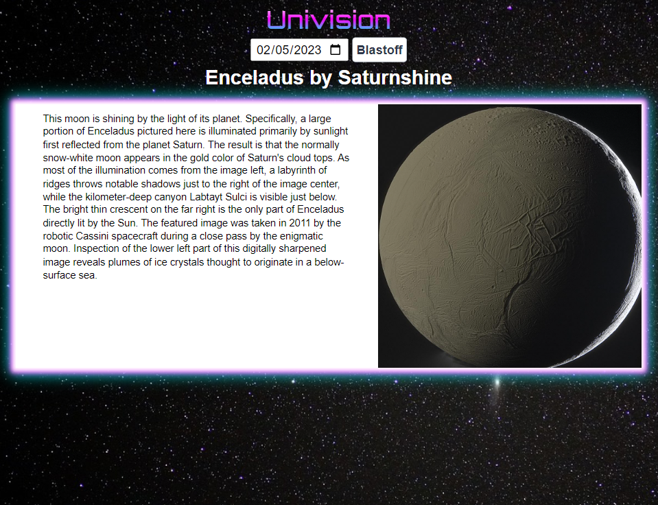

# Univision

A simple web application built with HTML, CSS, Javascript, and the [Nasa APOD API](https://api.nasa.gov/). This application allows users to view the image and description posted by NASA on any date.

## Technologies Used
The following technologies were used to build this application:
- HTML
- CSS
- JavaScript
- [NASA APOD API](https://api.nasa.gov/)

## Features
- Choose a date to view the NASA Astronomy Picture of The Day

### Usage
To utilize this application simply pick a date to view the picture of the day from that date.

#### Credits
This application was built using the following resources:
- [NASA APOD API](https://api.nasa.gov/)

#### License
This application has no license, forbidding use of this code for any purposes. This is due to the personal API key utilized for this project.